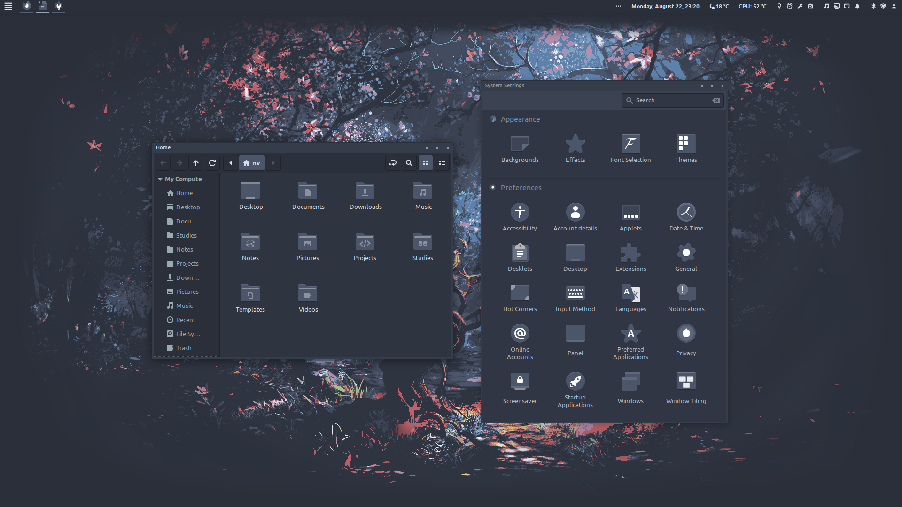
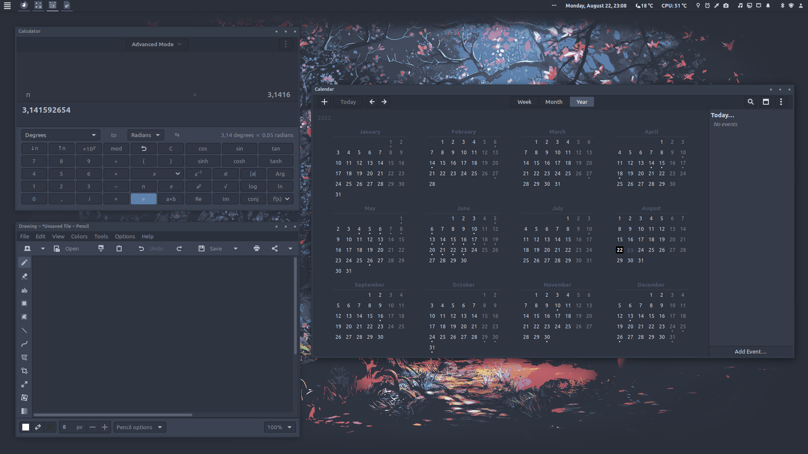
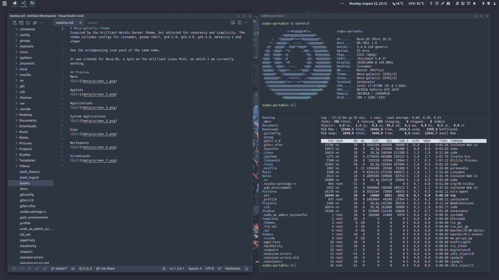
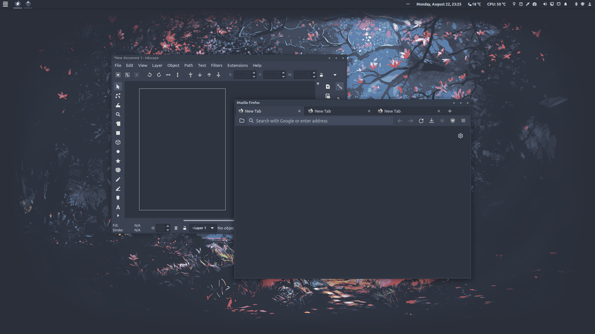

# NovaOS

**Attention**: Current ISO not working on all systems. Will be fixed soon.

My personal respin of the [Linux Mint](https://linuxmint.com) operating system, where "bloat" has been removed and the UI cleaned up and given a new coat of paint using my [theme](https://github.com/NicklasVraa/Nova-galactic-theme) and [icon-pack](https://github.com/NicklasVraa/Nova-galactic-icons).
It's based on Mint 20.3, but with the 5.15 kernel.

Thank you to [penguins-eggs](https://github.com/pieroproietti/penguins-eggs) for making the process of distributing ISO's easy.

|                                   |                           |
|-----------------------------------|---------------------------|
|           |    |
|    |   |
|         |  |
|  |      |

## Installation
1. Download the [ISO](https://drive.google.com/drive/folders/1djzd2mm6oHLx1MuvaAjNLqDi0mUxStYA?usp=share_link).
2. Create a bootable USB (e.g. using [Rufus](https://rufus.ie/en/)) and select the drive during boot. \
   The process of selecting a different boot-device depends on your hardware.
3. In the live-session, start a terminal and run `sudo eggs install`. Password: `nova`.
4. Run through the guided installation.

