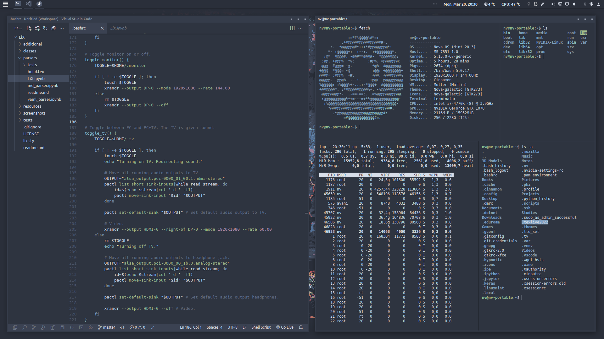

# NovaOS
My personal respin of the Linux Mint operating system, where bloat has been removed and the UI cleaned up and given a new coat of paint using a custom [theme](https://github.com/NicklasVraa/Nova-galactic-theme) and [icon-pack](https://github.com/NicklasVraa/Nova-galactic-icons).

|   |   |
|---|---|
|  |  |
|  |  |
|  |  |
|  |  |

## Installation
1. Download the [ISO](https://drive.google.com/drive/folders/1djzd2mm6oHLx1MuvaAjNLqDi0mUxStYA?usp=share_link).
2. Create a bootable USB and select it during boot. \
   This process depends on your hardware and OS.
3. In the live-session, start a terminal and run sudo eggs install. \
   Password: `evolution`
4. Run through the guided installation.

## Post-Install Suggestions
- Uninstall penguins-eggs.
- Use the built-in updater or the terminal to update the system.
