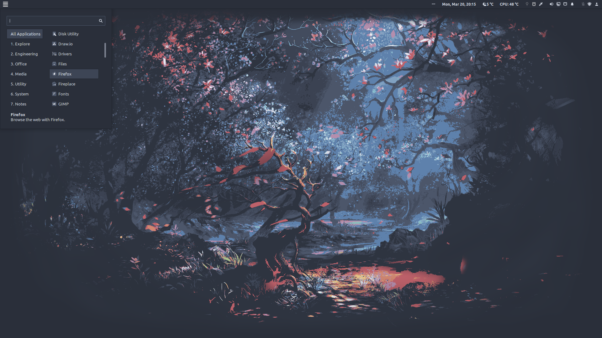

# NovaOS
Download the [ISO](https://drive.google.com/drive/folders/1f0jR0VEez13FHDwOYfysAfKcvFQYKSCm?usp=sharing) (2023-10-21 build). Confirmed to work in VirtualBox and on bare metal. Last updated 16/10/23.

This is a remake of [Linux Mint](https://linuxmint.com). The intention with this ISO is to provide a very minimal and optimized version of Mint with sensible defaults and a coherent experience and muted look-and-feel. It's based on Mint 20.3, but with the newer 5.15 kernel. It will receive the same updates as normal Linux Mint. Also check out the standalone [theme](https://github.com/NicklasVraa/Nova-galactic-theme) and [icon-pack](https://github.com/NicklasVraa/Nova-galactic-icons).

|                                   |                           |
|-----------------------------------|---------------------------|
|           |    |
|    |   |
|         |  |
|            |      |
|  |      |

Pre-installed software is kept to a minimum and has been appropriately themed and configured.
- Installed: Firefox, VSCode, Terminator, Obsidian, Drawio, LibreOffice7.5
- Recommended: TeXLive, Inkscape, GIMP, VirtualBox

If wanted, I can provide a version without any added pre-installed software.

## Installation
1. Download the [ISO](https://drive.google.com/drive/folders/1f0jR0VEez13FHDwOYfysAfKcvFQYKSCm?usp=sharing).
2. Create a bootable USB (e.g. using [Rufus](https://rufus.ie/en/)) and select the drive during boot. \
   The process of selecting a different boot-device depends on your hardware. You may need to disable secure-boot.
3. In the live-session, double-click the install icon on the desktop. An internet connection allows for automatic localization, but is not required.

## Post-Install
- If startup is slow, run `sudo rm /etc/initramfs-tools/conf.d/resume && sudo update-initramfs -u` in a terminal. This may take a second to complete.
- If Windows won't let you boot into Linux after installation, install and run `boot-repair` from within a terminal in the live session.
- Look for missing drivers using the driver-manager.
- Update the system using the update-manager. Start by refreshing.
- Add additional [wallpapers](https://drive.google.com/drive/folders/1HjrJrt7eDFPl18DLkWYUCWC0cEZfyRGJ?usp=sharing).

## Roadmap
- [ ] Post-install GUI for downloading and configuring recommended optional apps and explaining the UI.
- [ ] Global theme- and icon color changer.
- [ ] Custom Wallpaper generator.
- [ ] Color-matched Calamares installer.

---
**LEGAL NOTICE**: This repository, including any and all of its forks and derivatives, may NOT be used in the development or training of any machine learning model of any kind, without the explicit permission of the owner of the original repository.
